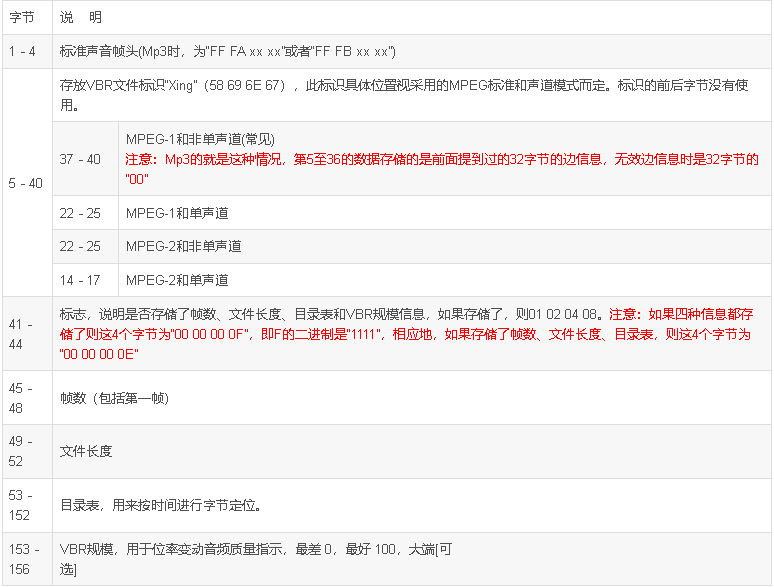

# Mp3帧分析（数据帧） #

**一、 帧**

帧头长4字节，是的，是4个字节，共32位。 帧头后面可能有两个字节的CRC 校验，这两个字节的是否存在决定于FRAMEHEADER 信息的第16bit， 为0 则帧头后面无校验，为1 则有校验,校验值长度为2 个字节，（后面是可变长度的附加信息，对于标准的MP3文件来说，其长度是32字节，本段括号内的文字内容有待商榷，暂时没见到这样的文件），紧接其后的是压缩的声音数据，当解码器读到此处时就进行解码了。

```
typedef FrameHeader {
    unsigned int sync: 11;                         //同步信息
    unsigned int version: 2;                       //版本
    unsigned int layer: 2;                                     //层
    unsigned int error protection: 1;                  // CRC校验
    unsigned int bitrate_index: 4;             //位率
    unsigned int sampling_frequency: 2;         //采样频率
    unsigned int padding: 1;                     //帧长调节
    unsigned int private: 1;                        //保留字
    unsigned int mode: 2;                          //声道模式
    unsigned int mode extension: 2;        //扩充模式
    unsigned int copyright: 1;                            // 版权
    unsigned int original: 1;                       //原版标志
    unsigned int emphasis: 2;                   //强调模式
}HEADER, *LPHEADER;
```


1.1  帧头4字节使用说明见表1。

表1 MP3帧头字节使用说明


**规律说明：根据上表的分析，所有的Mp3文件的数据帧开始的两个字节必需是“FF FA”或者 “FF FB”。**

1.2 MP3帧长的计算

MP3帧长取决于位率和频率，计算公式为：


Size=((采样个数  * (1 / 采样率))* 帧的比特率)/8  + 帧的填充大小

对于Mp3格式，

Size=((1152 * (1 / 采样率))* 帧的比特率)/8  + 帧的填充大小

=144*帧的比特率/采样率+帧的填充大小


a,帧的填充大小就是第23位的帧长调节，不是0就是1。

b,采样个数：MPEG的不同规范（MPEG-1/2/3），以及同一规范中不同的 Layer(Layer I/II/III)，每一帧
所对应的采样数，都是固定的，其具体的值参见下表：表 4   MPEG帧的采样数索引表（单位：个/帧）


3.举例说明

本例是王菲的怀念（大小4,680,730 字节）


前面的四个字节为“FF FB B0 64”对应的二进制串为“11111111  11111011  10110000  01100100”，参照前面的分析，第16位为“1”，则无校验数据；第17至20位为“1011”，则比特率=192kbps；第21至22位为“00”，则采样频率=44.1kHz；第23位为“0”，则帧长调整是0；所以帧长Size=144*192/44.1+0=626，前面除法需向下求整（但有时又是四舍五入）。所以在地址0x272处又开始了新的帧，我这里是“FF FB B0 44”。

**二 VBR 标志帧**

前面分析了帧的结构，Mp3文件分为CBR和VBR两种，这里着重分析一下VBR文件，VBR文件的第一个帧不是有效的数据帧，是它的标志帧。这种标志帧有Xing帧和VBRi帧。

2.1 Xing 帧

VBR 是XING 公司推出的算法，所以在MP3 的FRAME 里会有“XING"这个关键字（现在很多流行的小软件也可以进行VBR 压缩，它们是否遵守这个约定，那就不得而知了），它存放在MP3 文件中的第一个有效FRAME 里，它标识了这个MP3 文件是VBR 的。同时第一个FRAME 里存放了MP3 文件的FRAME 的总个数，这就很容易获得了播放总时间，同时还有100 个字节存放了播放总时间的100 个时间分段的FRAME 的INDEX，假设4 分钟的MP3 歌曲，240S， 分成100 段，每两个相邻INDEX 的时间差就是2.4S， 所以通过这个INDEX，只要前后处理少数的FRAME，就能快速找出我们需要快进的FRAME 头。

2.1.1 解析帧

表2 VBR Xing文件第一帧结构



2.1.2 举例说明

曲子是：刘德华 - 虹桥机场的咖啡厅.mp3（5,898,130字节，时长3分14秒）


a,第37至40地址为“58 69 6E 67”，就是“Xing”标志了；

b,第41至44地址为“00 00 00 0F”，这里是Flag了，表示该帧存储了帧数、文件长度、目录表和VBR规模信息。

c,第45至48地址为“00 00 1D 11”，这里是文件的总帧数（包括第一帧），是big-endia的，(1*16^3+13*16^2+1*16+1)帧。

d,第49至52地址为“00 59 FD DE”，这里是文件的总大小，也是Big-Endian的，(5*16^5+9*16^4+15*16^3+13*16^2+13*16+14)=5,897,694（字节）， 但是右键文件的属性发现却是5,898,130字节，这多出来的字节暂时还没弄明白（郁闷中）。

e,第53至152地址,就是一百个字节的目录表了（称作TOC表），如图蓝色地部分。

TOC (Table of Contents)

Contains of 100 indexes (one Byte length) for easier lookup in file. Approximately

solves problem with moving inside file.

Each Byte has a value according this formula:

(TOC[i] / 256) * fileLenInBytes

So if song lasts eg. 240 sec. and you want to jump to 60. sec. (and file is 5 000

000 Bytes length) you can use:

TOC[(60/240)*100] = TOC[25]

and corresponding Byte in file is then approximately at:

(TOC[25]/256) * 5000000

If you want to trim VBR file you should also reconstruct Frames, Bytes and TOC

properly.

TCO 索引的计算方式如下  文件长度 100 比如文件持续 240 秒，我需要跳到 60 秒，文件长度为 5000000 字节 计算如下TOC[(60/240)*100] =TOC[25] 然后相对于文件中的位置大约是在 (TOC[25]/256) * 5000000 如果要自己重建的话，基本是把这个步骤反过来做就可以了。要求准确的话，就需要根据时间点找到正确帧的位置然后再计算， 定位帧的做法都是从第一帧开始搜索。

f,第153至156字节地址为“00 00 00 64”，，音频质量指示质量指示器，为 0(最好)-100(最差)的 Big-Endian 值，没想到这个文件的音质是最差的100。

g,接下来是Lame版本的相关信息

2.2 VBRI帧（该种文件没有找到，此部分内容是完全摘抄的，供参考）

据了解，目前此头信息，只有用 Fraunhofer 的编码器生成的 MPEG音频文件，才会用到此
头。其和Xing 头不一样，其放在第一个MPEG头的后面，大小正好是 32字节。其位置，
长度和示例，都是以字节为单位。下表是 VBRi 头的具体格式及含义，单位为字节：


**三 Info 帧**

info帧，结构和Xing帧是相同的，从一些网上的资料显示：这种类型的帧有点怪，在CBR文件中的第一个数据帧可以是Info帧，在VBR文件中的第一个数据帧也有可能是Info帧，但是我个人更倾向于认为第一个数据帧为Info帧的文件是CBR文件，比如Kugoo软件制作的铃声的第一帧都是Info帧，而且是CBR文件。在下一篇博文（四）怎样区分是否是固定位率文件和这个有关。


————————————————

版权声明：本文为CSDN博主「xsjm206」的原创文章，遵循CC 4.0 BY-SA版权协议，转载请附上原文出处链接及本声明。

原文链接：https://blog.csdn.net/xsjm206/article/details/6719958