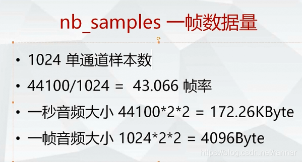
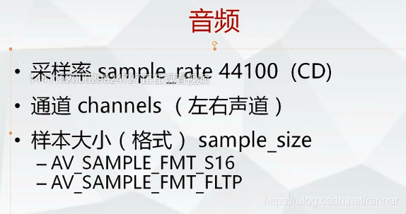

# 一帧音频的数据量 #

假如规定1024 个单通道样品数为一帧音频

则一秒钟有多少帧,即帧率为采样率/1024=44100/1024

一秒钟音频数据大小44100*2(双声道)*2(采样精度是AV_SAMPLE_FMT_S16,即2个byte,如果是FLTP则为4个byte,一般MP4中的AAC音频数据都是FLTP格式的,AV_SAMPLE_FMT_FLTP,FLT表示float,p表示两个声道的数据存放方式不是交错的,先放所有的左声道,再放所有的右声道)

一般音频数据都用小端模式,即高位数据存在高位地址,低位数据存在低位地址 

————————————————

版权声明：本文为CSDN博主「rannar」的原创文章，遵循CC 4.0 BY-SA版权协议，转载请附上原文出处链接及本声明。

原文链接：https://blog.csdn.net/rannar/article/details/86824168